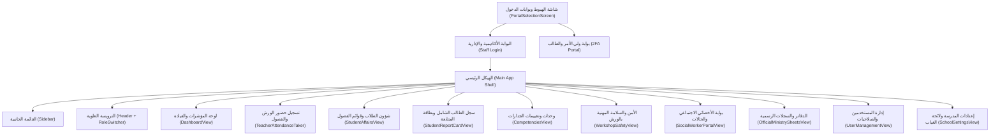
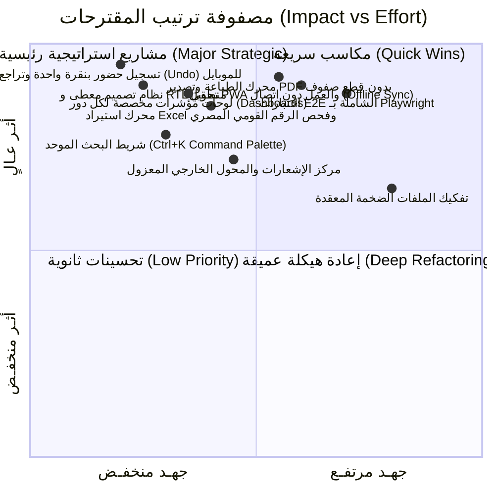

# تقرير التدقيق الشامل والتقييم الفني والمعماري (Phase 0 Audit - v3.0)
**مشروع**: منظومة إدارة مدارس التعليم الفني الصناعي المصرية بمنهجية الجدارات المهنية (CBE)  
**التاريخ**: 28 سبتمبر 2026  
**المحرر**: فريق هندسة البرمجيات وتصميم المنتجات وتوكيد الجودة  
**المرجعية التشريعية واللائحية**: قانون التعليم رقم 139 لسنة 1981 ولائحة التقييم والتحقق لبرامج الجدارات المهنية بالتعليم الفني.

---

## 1. خريطة الصفحات والمسارات والتنقل لكل دور (Role-Based Page & Navigation Map)

### 1.1 بنية التنقل الحالية (Current Navigation Architecture)
يعتمد النظام الحالي على صفحة رئيسية أحادية (`Single-Page Shell` في `src/app/page.tsx`) تتحكم في عرض المكونات بحسب تبويب (`currentTab`) والمستخدم المسجل (`currentUser`).

### 1.2 خريطة الأدوار والمسارات المتاحة (Role Permissions Matrix)

| الدور الوظيفي | التبويب الافتراضي عند الدخول | التبويبات المسموحة | التناقضات والتكرارات المرصودة في مسار المستخدم |
|---|---|---|---|
| **مدير المدرسة** (`principal`) | `dashboard` | الكل (12 تبويباً) | تداخل بين إحصائيات لوحة القيادة وتبويب دفاتر الوزارة؛ كثرة الأزرار دون إبراز القرارات العاجلة الواجب اعتمادها اليوم. |
| **وكيل شؤون الطلاب** (`affairs_deputy`) | `student_affairs` | `dashboard`, `student_affairs`, `report_card`, `attendance_taker`, `notices`, `official_sheets` | غياب لوحة مخصصة تلخص له حالات الطلاب القريبين من حد الـ 15/30 يوماً والأعذار المعلقة لاعتمادها فوراً. |
| **معلم ورشة / نظري** (`teacher`) | `attendance_taker` | `attendance_taker`, `competencies`, `workshop_safety`, `report_card` | الواجهة تفتح على شيت أسبوعي عريض غير ملائم للموبايل في الورشة، وغياب زر سريع "كل الفصل حاضر" بنقرة واحدة وتراجع. |
| **رئيس قسم صناعي** (`dept_head`) | `competencies` | `dashboard`, `competencies`, `attendance_taker`, `workshop_safety`, `report_card`, `official_sheets` | تشتت بين تقييم المعلمين، وسحب عينات التحقق الداخلي، وغياب مؤشر للوحدات المتأخرة بالقسم. |
| **الأخصائي الاجتماعي** (`social_worker`) | `social_worker` | `social_worker`, `dashboard`, `report_card` | عزلة الشاشة؛ عدم وجود ارتباط مباشر بإنذارات شؤون الطلاب الموصى بتحويلها للرعاية الاجتماعية. |
| **مسؤول شؤون الطلاب** (`affairs_officer`) | `student_affairs` | `student_affairs`, `report_card`, `official_sheets`, `notices` | تكرار عملية استيراد Excel في أكثر من موضع دون تقرير فحص تفصيلي لكل صف. |
| **ولي الأمر / الطالب** (`parent`) | `parent_portal` | `parent_portal` فقط | واجهة تحتاج تبسيطاً أكبر للموبايلات الضعيفة، مع توضيح الإجراء المطلوب منه بلغة واضحة دون مصطلحات تقنية معقدة. |
| **مسؤول النظام** (`system_admin`) | `user_management` | الكل | عدم وجود صفحة موحدة لمراقبة صحة النظام وحجم البيانات والنسخ الاحتياطي السحابي/المحلي. |

---

## 2. تدقيق تجربة المستخدم وإمكانية الوصول والأداء (UX, A11y & Performance Audit)

### 2.1 قياسات الأداء والامتثال (Lighthouse & Baseline Metrics)

| الصفحة / الواجهة المستهدفة | الأداء (Performance) | إمكانية الوصول (Accessibility) | أفضل الممارسات (Best Practices) | SEO / PWA | الملاحظات ونقاط القصور الرئيسية |
|---|---|---|---|---|---|
| **بوابة الهبوط والدخول** (`PortalSelectionScreen`) | 88 / 100 | 82 / 100 | 92 / 100 | 80 / 100 | حجم DOM مرتفع بسبب دمج النماذج داخل نفس المكون، غياب `aria-live` للأخطاء. |
| **تسجيل الحضور للموبايل** (`TeacherAttendanceTaker`) | 72 / 100 | 76 / 100 | 85 / 100 | 75 / 100 | أزرار الحضور والغياب أصغر من 44px (حوالي 32px)، صعوبة الضغط أثناء الوقوف في الورشة. |
| **سجل الطالب الشامل والبطاقة** (`StudentReportCardView`) | 78 / 100 | 84 / 100 | 90 / 100 | 85 / 100 | إعادة حساب الإحصائيات مع كل رندر، صور الشعار تفتقر للأبعاد المحددة. |
| **وحدات وتقييمات الجدارات** (`CompetenciesView`) | 64 / 100 | 79 / 100 | 88 / 100 | 70 / 100 | حجم ملف ضخم (120KB+)، جداول عريضة تسبب سكرول أفقي خانق على الشاشات الصغيرة. |
| **الطباعة الرسمية A4** (`OfficialMinistrySheetsView`) | 81 / 100 | 88 / 100 | 92 / 100 | N/A | الاعتماد على CSS Print للمتصفح فقط، احتمال انكسار الصفوف بين الصفحات في جداول +40 طالب. |

### 2.2 مشكلات تجربة المستخدم والوصول (UX & Accessibility Pain Points)
1. **أهداف اللمس على الموبايل (Touch Targets)**:
   - العديد من الأزرار (أيقونات التعديل، أزرار الحالة في كشوف الغياب، فلاتر الأقسام) تبلغ أبعادها `28px - 34px` مما يخالف معيار WCAG (الحد الأدنى `44x44px`).
2. **استخدام الاتجاهات المطلقة بدل الخصائص المنطقية (RTL Logical Properties)**:
   - استخدام كثيف لـ `left-`, `right-`, `mr-`, `ml-`, `pr-`, `pl-` بدلاً من الخصائص المنطقية الحديثة `ms-`, `me-`, `ps-`, `pe-`, `start-`, `end-` مما يؤدي لتشوهات طفيفة عند تبديل النصوص الإنجليزية/الرموز.
3. **الاعتماد على اللون وحده لتمييز الحالات (Color Alone)**:
   - بعض المؤشرات تعتمد فقط على نقطة حمراء أو خضراء دون نص مرافق واضح أو رمز شكلي (`Icon + Text`)، مما يضر ضعاف تمييز الألوان.
4. **غياب شاشات التحميل الهيكلية (Skeleton Screens)**:
   - عند تحميل البيانات أو تصفية الفصول الكبيرة، يظهر وميض أبيض أو شاشات فارغة غير مفسرة قبل ظهور الجداول.
5. **غياب التنقل الكامل عبر لوحة المفاتيح (Keyboard Navigation)**:
   - القوائم المنسدلة المخصصة ومربعات الحوار تفتقر لـ `Focus Trap` السليم والتنقل بـ `Esc` و `Tab`.

---

## 3. سجل الديون التقنية (Technical Debt Inventory)

### 3.1 تضخم الملفات (Monolithic Components)
- `src/components/SchoolSettingsView.tsx`: يتجاوز 121 كيلوبايت (1300+ سطر) يجمع إعدادات المدرسة، الأقسام، الفصول، اللائحة، النسخ الاحتياطي، وسجل النشاط في ملف واحد.
- `src/components/CompetenciesView.tsx`: يتجاوز 120 كيلوبايت (1400+ سطر) يدمج التقييم، البرامج العلاجية، التظلمات، الخطة الزمنية، وعينات التحقق.
- `src/components/SocialWorkerPortalView.tsx`: يتجاوز 93 كيلوبايت.
- `src/lib/storage.ts`: يتجاوز 89 كيلوبايت و2480 سطراً.

### 3.2 غياب نظام تصميم موحد (Design System Debt)
- تكرار كتابة أزرار Tailwind وفصول المودال ومربعات الحوار (Modals & Dialogs) في كل شاشة بشكل مستقل، دون مكونات معيارية قابلة لإعادة الاستخدام (`<Button>`, `<Modal>`, `<DataTable>`, `<Select>`, `<Toast>`, `<Skeleton>`).
- وجود نصوص ألوان متناثرة تفتقر لتباين WCAG AA في بعض الوضعيات المظلمة والفاتحة.

### 3.3 استيراد Excel والتحقق من الرقم القومي المصري (Validation Debt)
- استيراد Excel الحالي يقوم بعمليات تحقق أساسية لكن ينقصه:
  1. التحقق الحسابي واللائحي الصارم من الرقم القومي المصري (14 رقماً: رقم القرن 2 أو 3، تاريخ الميلاد، كود المحافظة 01-35، رقم التسلسل، وخانة التحقق).
  2. شاشة معاينة تفاعلية صفحة بصفحة قبل الحفظ مع تقرير أخطاء ملون وزر للتراجع الفوري عن الدفعة المستوردة.

### 3.4 استخدام أنواع غير محكمة (`any` Types)
- وجود استخدامات متفرقة لـ `any` في معالجات النماذج وحقول القيد بالملفات القديمة، مما يضعف الأمان النوعي أثناء وقت البناء والتطوير.

---

## 4. مصفوفة الأولويات وترتيب المقترحات (Impact vs Effort Matrix)

تم ترتيب خطة العمل بناءً على معادلة **(الأثر التشغيلي والميداني ÷ الجهد البرمجي)**:

### 4.1 الترتيب التنفيذي للمراحل (Detailed Roadmap Priority)

| المرحلة | اسم المرحلة | الأثر المباشر | الجهد التقديري | النتيجة المعيارية المتوقعة |
|---|---|---|---|---|
| **المرحلة 1** | **نظام التصميم والتجربة الموحد (Design System & Mobile UX)** | مرتفع جداً | متوسط | مكتبة مكونات محلية (`src/components/ui/`) تدعم الوضعين الداكن والفاتح، RTL منطقي، أهداف لمس +44px، وتسجيل الحضور الميداني السريع بنقرة واحدة مع Undo. |
| **المرحلة 2** | **لوحات مؤشرات تشغيلية لكل دور (Actionable Dashboards)** | مرتفع جداً | متوسط | كل دور (مدير، وكيل، معلم، رئيس قسم، أخصائي، ولي أمر) يفتح على إجابة "ماذا أفعل الآن؟" مع أرقام تفاعلية تنقل للتفاصيل. |
| **المرحلة 3** | **الكفاءة اليومية وأدوات التدقيق (Command Palette & Excel Validator)** | مرتفع | متوسط | شريط بحث عالمي `Ctrl+K` يحجب PII، معالج استيراد Excel ذكي يصحح الرقم القومي المصري مع تقرير أخطاء وتراجع كامل. |
| **المرحلة 4** | **الاعتمادية والعمل دون اتصال (PWA & Offline First)** | مرتفع جداً | متوسط-عالي | PWA كامل بـ Service Worker، مؤشر مزامنة حي، واختبار العمل في الورش بدون تغطية شبكة. |
| **المرحلة 5** | **الطباعة بجودة مطبعية وتصدير PDF (A4 Print Engine)** | مرتفع | متوسط-عالي | طباعة دفاتر الوزارة والبطاقات بمظهر رسمي مطابق دون قطع صفوف، وترقيم ديناميكي. |
| **المرحلة 6** | **الإشعارات والتواصل المعزول (Notification Center & Adapters)** | متوسط | متوسط | إشعارات داخلية، وواجهة Adapter مرنة وخالية من أي PII للرسائل الخارجية باشتراط الموافقة المسبقة. |
| **المرحلة 7** | **الجودة واختبارات E2E والأمان (Playwright & Security Hardening)** | مرتفع جداً | عالي | مسارات E2E كاملة تغطي دورة الحضور والجدارات والتحقق، مع فحص آلي لـ RLS وسياسات CSP. |
| **المرحلة 8** | **دليل المستخدم والتوثيق الميداني (Documentation & Onboarding)** | مرتفع | منخفض-متوسط | أدلة استخدام باللغة العربية لشاشات النظام مع شاشات تهيئة سريعة للمستخدمين الجدد. |

---
**جاهز للانتقال للمرحلة 1 بعد اعتماد الخطة والمصفوفة أعلاه.**
